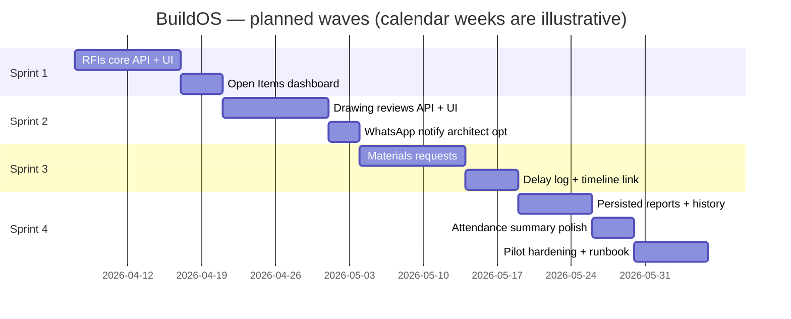

# BuildOS — Sprint plan & timeline

> **Cadence:** 2-week sprints (adjust to 1-week if you want faster feedback).  
> **Assumption:** One primary builder + occasional review; scale tasks if you add people.

---

## Where things stand (baseline)

| Area | Status |
|------|--------|
| Monorepo, auth, tenants, projects CRUD | Shipped |
| WhatsApp ingest → pg-boss → processor | Shipped |
| Dashboard: portfolio, project shell, diary, photos, files (with upload), team, costs, timeline, reports (PDF export) | Shipped |
| Budget summary, charts, in-app alerts, WhatsApp budget thresholds | Shipped |
| RFIs (CRUD, open items, drawing link) | Shipped |
| Drawing reviews (CRUD, revisions, file upload, status workflow, WhatsApp notify) | Shipped |
| Materials requests (CRUD, line items, delivery tracking) | Shipped |
| Delays (CRUD, RFI link, PM review, timeline integration) | Shipped |
| Persisted progress reports (`ProgressReport` + storage + AI narrative) | Shipped |
| Attendance summary (bar chart on overview) | Shipped |
| Pilot checklist (BIL onboarding) | Not formalized in repo |

---

## Guiding priorities

1. **Disputes & coordination** — RFIs and delays protect the contractor.  
2. **Design control** — Drawing reviews before major spend.  
3. **Procurement loop** — Materials requests tied to approvals and costs.  
4. **Trust & ops** — Stored reports, stable deploys, pilot runbook.

---

## Sprint overview (8 weeks, 4 × 2-week sprints)



*(Shift start dates to your real sprint kickoff; dependencies are sequential within each block where noted.)*

---

## Sprint 1 — RFIs + Open Items (Weeks 1–2)

**Status (implemented):** Nest `RfisModule` (`GET/POST/PATCH` under `projects/:id/rfis`, `GET /rfis` for tenant); web **Open Items** + project **RFIs** tab with create/update.

**Goal:** Replace placeholders with real RFI tracking and a useful **Open Items** view.

| Work item | Outcome |
|-----------|---------|
| Prisma / API: list/create/patch RFIs per project + tenant scope | REST aligned with existing patterns (guards, DTOs) |
| RFI numbering | `TENANT-PROJECT-RFI-###` or plan’s convention |
| Status workflow | Draft → Open → Answered → Closed (min set) |
| Web: `/projects/[id]/rfis` | Table + create/edit; filter by status |
| Web: `/open-items` | Cross-project overdue / open RFIs (and hooks) |
| Optional | WhatsApp stub or “notify” queue item for escalation (defer if tight) |

**Exit criteria:** PM can create an RFI, see it on the project and on Open Items; data survives refresh.

**Risks:** Scope creep on WhatsApp — keep notify as stretch for Sprint 2 if needed.

---

## Sprint 2 — Drawing reviews (Weeks 3–4)

**Goal:** Upload, status, revision history; architect loop.

| Work item | Outcome |
|-----------|---------|
| API: drawings CRUD + file upload to Supabase Storage | Same patterns as `files` module |
| Status flow | e.g. Draft → Submitted → In review → Approved / Revise |
| Web: `/projects/[id]/drawings` | List + upload + status transitions |
| Notifications | WhatsApp to architect on submit/change (if infra stable) |

**Exit criteria:** One drawing can be uploaded, moved through statuses, second version attached.

---

## Sprint 3 — Materials + delays (Weeks 5–6)

**Goal:** Protect against overruns and disputes on supply and time.

| Work item | Outcome |
|-----------|---------|
| Materials: create request, line items, approval fields | Match schema / plan |
| Optional | MD approval via WhatsApp reply (phase 2 if heavy) |
| Delays: create from dashboard + link to diary/timeline context | Foreman WhatsApp → AI later |
| Web: materials + delays tabs | Lists, forms, RBAC where financial |

**Exit criteria:** PM can log a materials request and a delay; both visible on project.

---

## Sprint 4 — Reports persistence + pilot (Weeks 7–8)

**Goal:** Professional client delivery + readiness for BIL.

| Work item | Outcome |
|-----------|---------|
| Persist `ProgressReport` rows + storage URL for PDFs | List “sent reports” per project |
| Optional GPT narrative | Behind feature flag / env |
| Attendance | Friday summary or richer chart (pick one) |
| Ops | Env validation, logging, Sentry optional; deploy checklist |
| Pilot | Runbook: tenant, projects, phones, 1h training script |

**Exit criteria:** At least one stored report record + PDF path; pilot doc reviewed with stakeholders.

---

## Dependency graph (simplified)

```
Sprint 1 (RFIs)
    └── Sprint 2 (Drawings)     [can parallelize materials *design* only]
              └── Sprint 3 (Materials + Delays)
                        └── Sprint 4 (Reports + Pilot)
```

RFIs and drawings can overlap **only** if two people work in parallel; one developer should finish RFI core before deep drawing work to avoid context switching.

---

## Weekly rhythm (suggested)

| Day | Focus |
|-----|--------|
| Mon | Plan sprint tasks; cut scope if needed |
| Tue–Thu | Deep work; API first, then UI |
| Fri | Demo to yourself / client; note bugs; adjust next week |

---

## Definition of Done (global)

- Tenant isolation on all new endpoints (`TenantGuard` + Prisma `tenantId`).
- No secrets in client bundles; env documented in `.env.example`.
- `npm run build` passes for `apps/web` and `apps/api` before merging.

---

## After these four sprints

- Harden WhatsApp intents for RFI/materials/delay **parsing** (AI) as a separate wave.  
- Billing / Paystack when commercial terms require it.  
- Mobile PWA or native — only if dashboard adoption is proven.

---

*Last updated to reflect roadmap discussion; adjust dates to your actual sprint start.*
